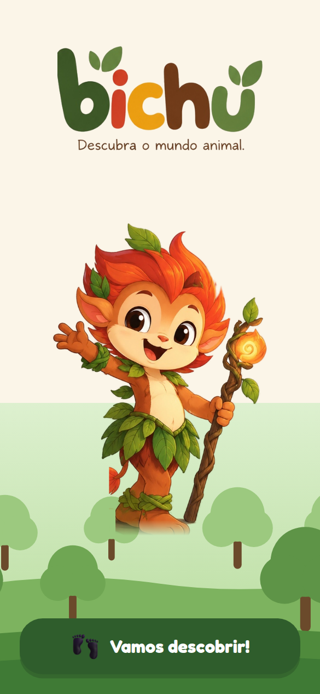
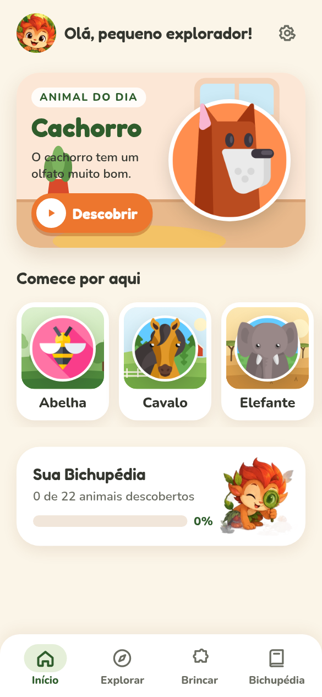
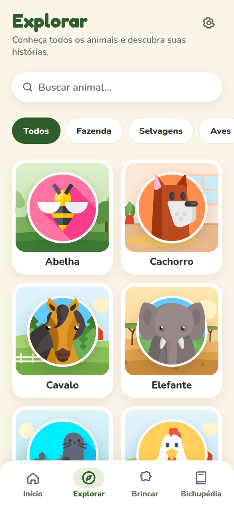
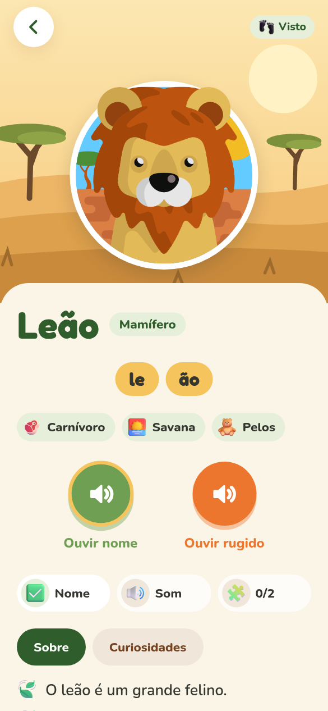
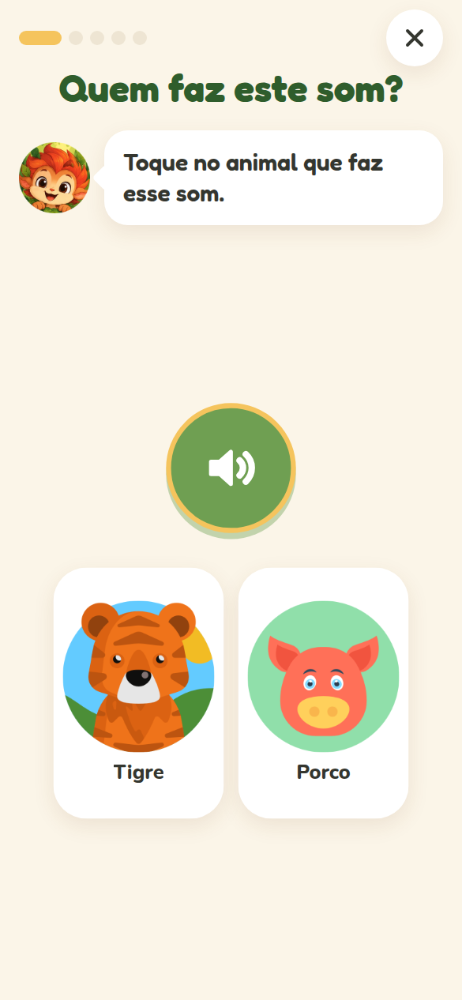
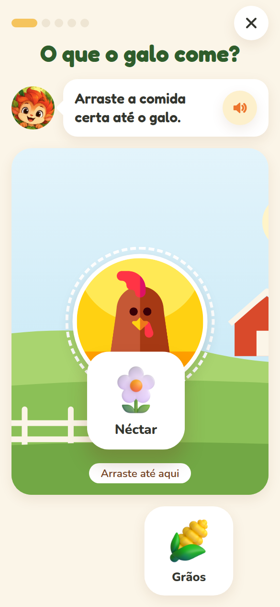
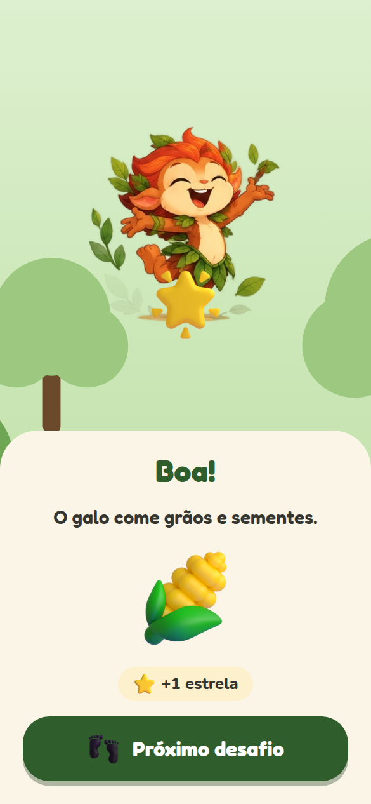
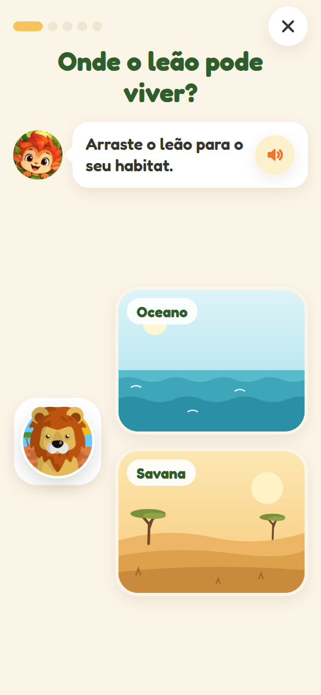
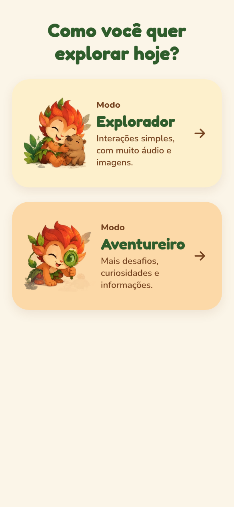
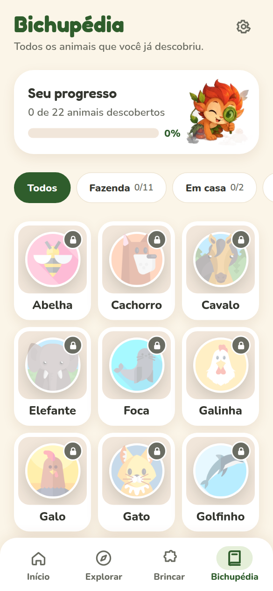

# bichu

**Descubra o mundo animal.**

Bichu é um app infantil (≈ 2–8 anos) de descoberta do mundo animal, reescrito em **React Native + Expo + TypeScript** a partir do antigo Zoo Babies / AnimalSounds. A criança vê um animal, ouve o nome e a silabação gravados, ouve o som real, conhece fatos simples, completa desafios e adiciona o animal à **Bichupédia**. A realidade aumentada é um complemento experimental — o app funciona completo sem ela.

| Boas-vindas | Início | Explorar | Animal | Que animal é esse? |
|---|---|---|---|---|
|  |  |  |  |  |
| **O que ele come?** | **Muito bem!** | **Onde ele vive?** | **Modo** | **Bichupédia** |
|  |  |  |  |  |

> Documentação de produto, marca e conteúdo do handoff: [`docs/PRODUCT.md`](docs/PRODUCT.md), [`docs/TECHNICAL.md`](docs/TECHNICAL.md), [`docs/BRAND.md`](docs/BRAND.md), [`docs/CONTENT_MODEL.md`](docs/CONTENT_MODEL.md).

---

## Como instalar e rodar

Requisitos: Node 20+ (testado com 22) e npm.

O app usa **development build** (`expo-dev-client`); o Expo Go não é suportado.

```bash
npm install
npm run ios       # expo run:ios — compila e abre no simulador iOS (precisa de Xcode)
npm run android   # expo run:android — precisa de Android Studio
npx expo start    # só o Metro, para um development build já instalado
```

Sem Xcode/Android Studio, gere o development build na nuvem com EAS (seção abaixo).

Todo o conteúdo (22 animais, imagens, sons, locuções) já está no repositório. Não há backend, conta, banco remoto nem internet obrigatória.

### Scripts

| Comando | O que faz |
|---|---|
| `npm run validate` | lint + typecheck + validação de conteúdo + testes (use antes de abrir PR) |
| `npm run validate:content` | valida seed, templates, manifesto legado e registro de mídia |
| `npm test` | testes de domínio (Jest) |
| `npm run lint` / `npm run typecheck` | ESLint (`expo lint`) / `tsc --noEmit` |
| `npm run format` | Prettier |
| `npm run assets:fetch` | baixa os assets legados e regenera o registro de mídia |
| `npm run assets:registry` | regenera `src/content/media.generated.ts` a partir do seed |

---

## EAS (builds, lojas e updates)

Projeto EAS: [`@mxczpiscioneri/bichu`](https://expo.dev/accounts/mxczpiscioneri/projects/bichu) · bundle id / package `br.com.techhands.bichu` · Apple Team `GD2JNB5JH9`. Perfis em [`eas.json`](eas.json):

| Perfil | Uso | AR (`BICHU_AR`) | Canal de update |
|---|---|---|---|
| `development` | Dev Client em aparelho | sim | `development` |
| `development-simulator` | Dev Client no simulador iOS | não (ViroKit só tem binário para aparelho) | `development` |
| `preview` | build interno para testes | sim | `preview` |
| `production` | lojas (versão incrementada no EAS) | não | `production` |

```bash
npx eas-cli@latest build --profile development-simulator --platform ios
npx eas-cli@latest build --profile production --platform all
npx eas-cli@latest update --channel preview --message "…"
```

⚠️ **Privacidade:** updates OTA (`expo-updates`, `runtimeVersion` = versão do app) consultam `u.expo.dev` ao abrir o app — a única chamada de rede do Bichu. A requisição leva plataforma, versão/canal e um `EAS-Client-ID` (UUID aleatório e persistente por instalação, gerado pelo `expo-updates`); nenhum dado da criança. Sem internet o app funciona normalmente com o bundle embutido. Avaliar esse identificador na política de privacidade antes de publicar.

### Realidade aumentada (experimental)

A AR é um **spike isolado** com [ViroReact](https://github.com/ReactVision/viro) (`@reactvision/react-viro`) sobre ARKit/ARCore. Ela é **opt-in em tempo de build**: sem `BICHU_AR=1`, o plugin do Viro não roda, o módulo nativo não é linkado (`react-native.config.js`) e o app não pede câmera.

```bash
npm run run:ios:ar        # BICHU_AR=1 expo run:ios  (aparelho físico com ARKit)
npm run run:android:ar    # BICHU_AR=1 expo run:android (aparelho com ARCore)
npm run start:ar          # Metro para o Dev Client com AR habilitado
```

Fluxo do spike (`app/ar/[animalId].tsx`): abre a câmera → detecta um plano horizontal → “Encontrei um lugar!” → toque posiciona **um** animal → girar (dois dedos), escala limitada por pinça (0,5×–2× do `defaultScale`) e arrastar sobre o plano → nome, som e desafio acontecem na UI 2D ao redor, usando o mesmo Challenge Engine do app. Sem física, andar ou comer.

**Modelos 3D:** os 22 animais têm GLB em [`assets/animals/models/`](assets/animals/models/) (Quaternius CC0 + Poly by Google CC BY 3.0; relatório em [`docs/3D_ASSET_REPORT.md`](docs/3D_ASSET_REPORT.md), créditos em [`docs/3D_ATTRIBUTIONS.md`](docs/3D_ATTRIBUTIONS.md)). Por ora só os 5 do spike técnico — leão, elefante, cavalo, golfinho e papagaio — estão ligados no seed (`media.model3d`); nos demais o botão “Ver no meu mundo” continua oculto até o spike ser confirmado em aparelho. ⚠️ Os modelos CC BY exigem uma tela de créditos no app antes de publicar.

Privacidade na AR: só a permissão de câmera é declarada; o plugin `plugins/withChildPrivacy.js` remove as descrições de microfone, fotos e localização que o Viro adiciona por padrão. Nenhuma imagem é salva ou enviada.

---

## Assets legados

As 22 imagens, 22 sons reais e 22 locuções de nome (“Elefante. E-le-fan-te.”) vêm de [`mxczpiscioneri/AnimalSounds`](https://github.com/mxczpiscioneri/AnimalSounds), mapeados em [`legacy/ASSET_MANIFEST.json`](legacy/ASSET_MANIFEST.json).

```bash
npm run assets:fetch             # baixa apenas o que falta
npm run assets:fetch -- --force  # baixa tudo de novo
```

O script (`scripts/fetch-legacy-assets.ts`) baixa **somente** os arquivos do manifesto (nunca `keystore.jks`, `google-services.json` ou arquivos de build), confere a assinatura PNG/MP3, grava `legacy/ASSET_CHECKSUMS.json`, gera `reports/asset-report.md` e sai com erro se algo faltar. Também importa o som de acerto do app antigo (`discover_win.mp3` → `assets/ui/sounds/correct.mp3`).

⚠️ Antes de publicar: [`legacy/ASSET_RIGHTS_CHECKLIST.md`](legacy/ASSET_RIGHTS_CHECKLIST.md). Estar num repositório público não é licença comercial.

---

## Arte nova dos animais

As ilustrações antigas (circulares) estão sendo trocadas por artes de corpo inteiro com fundo transparente. As duas convivem: cada animal usa a nova assim que ela existe (`media.imageStyle: "cutout"`) e a antiga (`"badge"`, em medalhão) até lá. Com arte nova, o animal aparece em pé sobre o cenário e, na Bichupédia, os ainda não descobertos viram silhueta.

Para adicionar ou trocar uma arte:

1. Salve em `assets/animals/art/<id>.png`: PNG **quadrado** (768×768), fundo **transparente**, animal inteiro com margem de ~5% e patas na mesma linha de base dos outros.
2. `npm run assets:art`. O comando aponta o seed para a arte nova, regenera o registro de mídia, confere se o PNG é quadrado e transparente e lista quem ainda está com a ilustração antiga.
3. `npm run validate`.

## Como adicionar um novo animal

1. Coloque os arquivos seguindo o id (slug em inglês):
   `assets/animals/images/<id>.png`, `assets/animals/sounds/<id>.mp3`, `assets/animals/names/<id>_name.mp3`.
2. Adicione a entrada em [`content/animals/legacy-seed.json`](content/animals/legacy-seed.json) (schema: [`content/animals/animal.schema.json`](content/animals/animal.schema.json)). Campos que merecem atenção:
   - `name.article` (`"o"`/`"a"`) — monta “O que **o** leão come?”.
   - `name.syllables` — precisam formar o nome (validado).
   - `foods`, `habitats`, `locomotion`… usam as taxonomias fechadas de [`src/domain/taxonomy.ts`](src/domain/taxonomy.ts).
   - `soundGroup` — se o som puder ser confundido com outro animal (ex.: `"roar"` para leão/tigre/urso).
   - `challengeFlags` — desligue (`false`) qualquer desafio cuja resposta seria ambígua para esse animal (ex.: “urso” genérico não tem dieta única → `food: false`).
3. `npm run assets:registry` e `npm run validate`.

Coleções (Explorar e Bichupédia) são filtros declarativos em [`src/content/collections.ts`](src/content/collections.ts): o novo animal entra automaticamente nas que combinarem.

## Como adicionar um modelo GLB

1. Gere o arquivo com o pipeline em [`tools/3d-pipeline/`](tools/3d-pipeline/README.md) (metros, frente em +Z, pivô no chão, texturas ≤ 1024 px, sem Draco/Meshopt/KTX2 — o ViroReact não lê) e salve em `assets/animals/models/<id>.glb`. Registre fonte e licença em `assets/animals/models/models.json` e `docs/3D_ATTRIBUTIONS.md`.
2. No seed, preencha:
   ```json
   "media": {
     "model3d": "assets/animals/models/lion.glb",
     "model3dMeta": {
       "license": "CC0-1.0",
       "author": "Nome do autor",
       "sourceUrl": "https://…",
       "defaultScale": 1,
       "realWorldHeightMeters": 1.356,
       "groundOffset": 0,
       "animations": []
     }
   }
   ```
   `license` e `author` são obrigatórios (a validação falha sem eles). Como os GLBs já estão em metros, `defaultScale: 1` é o tamanho real. Animações são opcionais e nunca exigidas.
3. `npm run assets:registry && npm run validate`, depois rode um build com `BICHU_AR=1`.

## Como criar um novo tipo de desafio

Os desafios são gerados a partir dos dados — não há perguntas escritas por animal.

1. **Template:** adicione a entrada em [`content/challenges/templates.json`](content/challenges/templates.json) (`id`, `interaction`, `title`, `subtitle`, `icon`, `levels`, `prompt`, `hint`, `explanation`). Tokens: `{animal}` (o leão), `{Animal}` (O leão), `{deAnimal}` (do leão), `{answer}`. Interações:
   - `tap` — toca numa alternativa (cartões grandes);
   - `drag` — arrasta a alternativa até o animal (ex.: comida);
   - `place` — arrasta o animal até a alternativa (ex.: habitat, mostrado como cenário).
2. **Tipo:** inclua o id em `CHALLENGE_TEMPLATE_IDS` ([`src/challenges/types.ts`](src/challenges/types.ts)).
3. **Regra:** crie um `AttributeRule` em [`src/challenges/rules.ts`](src/challenges/rules.ts): `correct(animal)` (todas as respostas certas), `distractors(animal)` (apenas respostas **seguramente** erradas, em ordem de preferência) e `label(value)`. Se não houver distrator seguro, o engine não gera o desafio — nunca gera um distrator plausível.
4. **Flag:** se o desafio puder ser ambíguo por animal, adicione uma chave em `challengeFlags`.
5. Rótulos/ícones pt-BR em [`src/content/labels.ts`](src/content/labels.ts); ícones novos em `assets/ui/icons` + [`src/content/icons.ts`](src/content/icons.ts).
6. `npm run validate` — os testes percorrem todos os animais × tipos × níveis verificando invariantes.

---

## Arquitetura

```
app/                        rotas (Expo Router)
  _layout.tsx               fontes, hidratação do progresso, Stack
  (tabs)/                   Início · Explorar · Brincar · Bichupédia (tab bar própria)
  animal/[id].tsx           tela do animal
  challenge/[type].tsx      sessão de desafios (tipo, ou type=animal&animalId=…)
  ar/[animalId].tsx         spike de AR (isolado)
  parents.tsx               área dos adultos (nível, progresso, privacidade) com parent gate
src/
  domain/                   tipos e regras puras (Animal, taxonomias, linguagem pt-BR)
  content/                  loader tipado + validação, rótulos, coleções, ícones, registro de mídia
  challenges/               Challenge Engine: templates, regras de distratores, sessões, hook de estado
  progress/                 regras de progressão puras + seletores
  stores/                   Zustand persistido em AsyncStorage (progresso, nível)
  audio/                    AudioService (canal único, fila nome → som)
  ar/                       carregamento opcional do Viro, cena AR, estado da AR
  components/               UI (ui/, brand/, animal/, challenge/, home/, feedback/, parents/)
  theme/                    tokens de design/theme.json, tipografia, paletas por habitat
content/                    seed dos animais, schema, templates de desafio (fonte da verdade)
assets/                     animals/{images,sounds,names,models}, brand/, ui/{icons,sounds}
scripts/                    importação de assets, registro de mídia, validação de conteúdo
plugins/                    config plugin de privacidade infantil (AR)
```

Princípios aplicados:

- **Um animal é conteúdo, não uma tela.** A mesma entidade alimenta Explorar, desafios, Bichupédia e AR.
- **Domínio puro e testável.** `domain/`, `challenges/` e `progress/` não importam React; o RNG é injetado (sessões determinísticas nos testes).
- **Estado do desafio fora do renderer.** `useChallengeSession` é usado pela tela 2D e pelo overlay da AR.
- **Mídia centralizada.** Metro só empacota `require()` estáticos, então `src/content/media.generated.ts` é gerado a partir do seed (e a validação acusa se estiver desatualizado). Nenhum caminho de asset espalhado pelas telas.
- **Áudio em canal único.** Tocar um clipe sempre interrompe o anterior; a tela do animal toca nome → som em sequência (modo Explorador), nunca sobrepostos.

### Regras de conteúdo e desafios

- Progressão: animal **descoberto** = ouviu o nome + ouviu o som + completou 2 tipos de desafio diferentes. Cada tipo novo concluído vale 1 estrela (máx. 3 por animal).
- Níveis: **Explorador** (2 alternativas, áudio automático, frases `preschool`) e **Aventureiro** (3 alternativas, fatos `kids`, desafio de classe). Mesmo app: o modo é escolhido no primeiro uso (“Como você quer explorar hoje?”) e depois na Área dos pais (engrenagem), que também tem o liga/desliga do som.
- Distratores seguros: alimentos agrupados em famílias (quem come `plants` nunca recebe `grass` como errado; onívoros só recebem néctar), habitats agrupados por paisagem (com paisagens vizinhas bloqueadas: savana ↔ floresta), locomoção só com opções claramente erradas (aves nunca recebem “voando” como errado; foca nunca recebe “rastejando”), sons confundíveis nunca juntos (`soundGroup`). Quando faltam distratores seguros, a pergunta fica com menos alternativas.

---

## Linguagem visual

A interface segue o mockup de referência das telas: cenários de habitat ilustrados, animal em destaque, cartões grandes, botões de áudio redondos (verde = nome, laranja = som), tela cheia de acerto com o Bichu e barra inferior simples.

- **Ícones ilustrados próprios** (`assets/ui/icons`, componente `Icon`) para conteúdo e navegação. Só o alto-falante branco dos botões redondos e as setinhas continuam em traço SVG (`LineIcon`), porque precisam mudar de cor.
- **Cenários ilustrados** em `assets/habitats/` (10 imagens 4:3: savana, campo, deserto, floresta, montanhas, oceano — também usado para praia —, rio/brejo, fazenda, casa e cidade), mapeados em `src/components/ui/HabitatScene.tsx`. O cenário de cada animal vem do seu primeiro habitat; as imagens são cortadas para caber, então o assunto deve ficar no centro.
- As ilustrações legadas são circulares, então aparecem como **medalhões** sobre os cenários. O mockup usa animais recortados em estilo pintado; testei recorte automático e o resultado não tinha qualidade (círculos residuais, partes do corpo perdidas). Esse visual exige novas ilustrações.
- Itens do mockup **não implementados de propósito:** aba “Galeria” e “favoritar” (não há conteúdo nem uso definido), música de fundo (não há trilha licenciada), escolha de idioma (só pt-BR por enquanto), botão de captura e “Tamanho real” na AR (a regra de privacidade proíbe salvar imagens da câmera; a escala real depende de modelos normalizados).

## Decisões sobre o handoff

A documentação do handoff é a fonte primária. Pequenas inconsistências encontradas e como foram resolvidas:

| Ponto | Decisão |
|---|---|
| `foods` do seed tinha valores fora da lista do TECHNICAL (`squid`, `hay`, `bark`, `prepared_food`…) | Taxonomia fechada de 20 alimentos em 6 famílias (`src/domain/taxonomy.ts`); a validação rejeita valores fora dela. |
| Templates usavam `{animal}` sem artigo (“O que leão come?”, “filhotes de o leão”) | `name.article` no seed + tokens `{Animal}`/`{deAnimal}`; templates v2 com `title`, `subtitle`, `icon` e `explanation`. |
| “Distractors must come from the same taxonomy” vs. “never mark plausible as wrong” | Regras por tipo em `rules.ts` com famílias/paisagens/tabelas por dieta; o engine reduz alternativas em vez de arriscar um distrator plausível. |
| “Que animal é esse?” podia juntar pintinho/galinha/galo ou leão/tigre | Campo opcional `soundGroup` (e `parentAnimalId`) exclui sons confundíveis. |
| Botão “Ouvir o som” genérico | Campo opcional `soundName` (“Ouvir o **rugido**”, “miado”…); cai para “som” quando ausente. |
| Schema sem metadados de modelo 3D | `media.model3dMeta` opcional (license/author obrigatórios quando há modelo). |
| `habitat: "mixed"` não é um lugar | Nunca vira alternativa nem resposta. |
| Script bash com lista fixa de URLs | Script TypeScript lendo o manifesto, com checksums, relatório e falha explícita. |
| PRODUCT sugere “Ver em AR” como 4º destino da home | Brief do MVP pede AR contextual: CTA só na tela do animal, quando há modelo e build com AR. |
| Onde escolher Explorador/Aventureiro sem expor idade à criança | Área dos adultos (`/parents`, prevista no TECHNICAL) com parent gate de “segurar 2,5 s”. |
| `expo-audio` adiciona microfone e background playback por padrão | Desligados no `app.config.ts`; permissões sensíveis bloqueadas no Android. |
| Interface de analytics (TECHNICAL §18) | Não implementada: o MVP não coleta nada. Fica para quando houver um provedor compatível com apps infantis. |

---

## Limitações conhecidas

- **AR não testada em aparelho** (este ambiente não tem dispositivo, Xcode nem Android SDK). Validado: `expo prebuild` com `BICHU_AR=1` aplica o plugin do Viro com as permissões esperadas; bundles JS de iOS/Android exportam sem erro. O RN Directory ainda marca o Viro como “untested on New Architecture”, embora o plugin do Viro 3.x declare suporte apenas à New Architecture — confirmar no primeiro build real.
- **AR ainda não verificada em aparelho:** os GLBs passam no glTF Validator e na conferência visual, mas o spike (5 animais) precisa ser confirmado no ViroReact antes de ligar os outros 17. Modelos CC BY exigem tela de créditos antes da publicação.
- **Builds nativos não foram compilados aqui**; o app foi verificado via testes, `expo export` (iOS/Android), `expo-doctor` (21/21) e navegação completa no web com gestos de toque.
- **Conteúdo em rascunho** (`status: draft-needs-content-review`): fatos zoológicos e pedagógicos precisam de revisão especializada antes da publicação.
- **Direitos de mídia pendentes** (imagens, sons e locuções legadas — ver checklist). Ícones: Microsoft Fluent Emoji (MIT, `assets/ui/icons/LICENSE.md`).
- **Marca provisória:** logo, ícone e poses do mascote são recortes raster do board aprovado (fundo removido automaticamente). Vetorização e character sheet oficiais continuam pendentes (docs/BRAND.md).
- A silabação acende as sílabas enquanto a locução toca, mas **não é sincronizada** sílaba a sílaba (não há marcação de tempo nos áudios).
- Enunciados dos desafios não têm narração própria; a criança ouve o nome do animal (ou o som, no “Que animal é esse?”) ao começar cada rodada.
- Apenas pt-BR. No web, o navegador pode bloquear o áudio automático antes do primeiro toque.
- **Conteúdo legado a revisar:** a imagem antiga `turkey.png` (“Peru”) é, na verdade, um **pavão**; some quando a arte nova do peru entrar em `assets/animals/art/turkey.png`.
