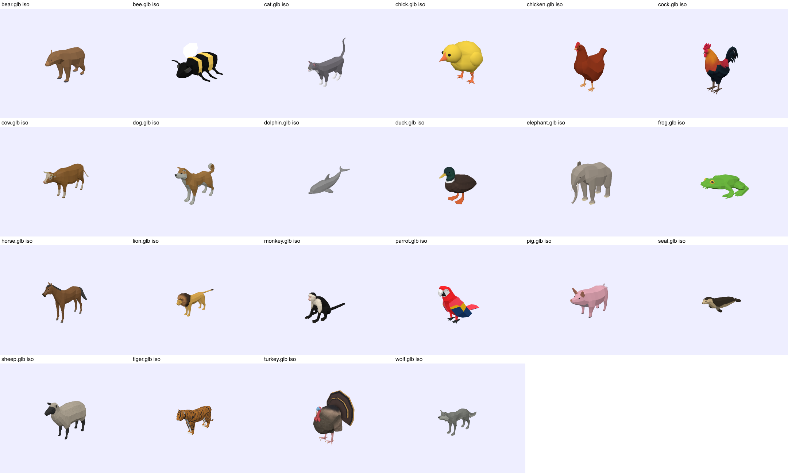

# Relatório de assets 3D

Data: 2026-09-27. Escopo: modelos GLB para os 22 animais do Bichu (AR com `@reactvision/react-viro` 3.0.1). Arquivos em `assets/animals/models/`, metadados em `models.json`, créditos em [`3D_ATTRIBUTIONS.md`](3D_ATTRIBUTIONS.md), pipeline reprodutível em [`tools/3d-pipeline/`](../tools/3d-pipeline/README.md).

## Resumo

- **Fontes:** 5 modelos do Quaternius (CC0) e 17 do acervo “Poly by Google” no Poly Pizza (CC BY 3.0). Os dois conjuntos usam o mesmo estilo: low-poly facetado, cor chapada, proporções naturais.
- **Desempenho:** todos abaixo da meta ideal: 392–2.450 triângulos, 8 KB–2,0 MB por arquivo (12 MB no total), texturas ≤ 1024 px, 1–3 materiais.
- **glTF Validator (Khronos):** 0 erros nos 22. Avisos só nos 5 modelos com rig (`NODE_SKINNED_MESH_NON_ROOT`, e `NODE_SKINNED_MESH_LOCAL_TRANSFORMS` no golfinho), idênticos aos dos arquivos originais do autor — padrão da exportação do Blender, sem efeito em renderizadores conformes.
- **Sem compressão:** os binários do ViroReact 3.0.1 (iOS `ViroKit` e Android `libviro_renderer.so`) só reconhecem `KHR_materials_unlit` e `KHR_lights_punctual`; não há Draco, Meshopt nem KTX2/Basis. Os GLBs usam apenas glTF 2.0 núcleo, sem extensões.
- **Ainda não verificado no aparelho:** os GLBs foram renderizados e conferidos em three.js (orientação, chão, materiais, esqueleto/animação), mas **nenhum foi visto ainda dentro do ViroReact em AR** (`arVerified: false`). Os 5 do spike estão ligados no seed para esse teste.

## Tabela

| Animal | Encontrado | Baixado | GLB pronto | Fonte | Licença | Autor | Tamanho | Animações | Status |
|---|---|---|---|---|---|---|---|---|---|
| Urso (`bear`) | sim | sim | sim | [Poly Pizza](https://poly.pizza/m/0PXWfxfb0Hu) | CC BY 3.0 | Poly by Google | 39 KB · 570 tri | — | `ready` |
| Abelha (`bee`) | sim | sim | sim | [Poly Pizza](https://poly.pizza/m/2177F_NMT--) | CC BY 3.0 | Poly by Google | 40 KB · 624 tri | — | `ready` |
| Gato (`cat`) | sim | sim | sim | [Poly Pizza](https://poly.pizza/m/6dM1J6f6pm9) | CC BY 3.0 | Poly by Google | 42 KB · 594 tri | — | `ready` |
| Pintinho (`chick`) | sim | sim | sim | [Poly Pizza](https://poly.pizza/m/fozJTmMX5yv) | CC BY 3.0 | Poly by Google | 24 KB · 676 tri | — | `ready` |
| Galinha (`chicken`) | sim | sim | sim | [Poly Pizza](https://poly.pizza/m/8Unya0rw9tR) | CC BY 3.0 | Poly by Google | 35 KB · 592 tri | — | `ready` |
| Galo (`cock`) | sim | sim | sim | [Poly Pizza](https://poly.pizza/m/6NTegstc5Jy) | CC BY 3.0 | Poly by Google | 557 KB · 1.200 tri | — | `ready` |
| Vaca (`cow`) | sim | sim | sim | [Quaternius UAA](https://quaternius.com/packs/ultimateanimatedanimals.html) | CC0 1.0 | Quaternius | 1.7 MB · 2.450 tri | 13 (idle, walk, run, jump, eat, attack, death) | `ready` |
| Cachorro (`dog`) | sim | sim | sim | [Quaternius UAA](https://quaternius.com/packs/ultimateanimatedanimals.html) | CC0 1.0 | Quaternius | 1.6 MB · 1.950 tri | 12 (idle, walk, run, jump, eat, attack, death) | `ready` |
| Golfinho (`dolphin`) ★ | sim | sim | sim | [Poly Pizza](https://poly.pizza/m/3LzFgI3GLO) | CC0 1.0 | Quaternius | 55 KB · 440 tri | 1 (swim) | `ready` |
| Pato (`duck`) | sim | sim | sim | [Poly Pizza](https://poly.pizza/m/frSLi6b6Vid) | CC BY 3.0 | Poly by Google | 258 KB · 656 tri | — | `ready` |
| Elefante (`elephant`) ★ | sim | sim | sim | [Poly Pizza](https://poly.pizza/m/cx0-TiCjDOx) | CC BY 3.0 | Poly by Google | 63 KB · 934 tri | — | `ready` |
| Sapo (`frog`) | sim | sim | sim | [Poly Pizza](https://poly.pizza/m/0QZHgL_V-Pj) | CC BY 3.0 | Poly by Google | 8 KB · 491 tri | — | `ready` |
| Cavalo (`horse`) ★ | sim | sim | sim | [Quaternius UAA](https://quaternius.com/packs/ultimateanimatedanimals.html) | CC0 1.0 | Quaternius | 2.0 MB · 2.182 tri | 13 (idle, walk, run, jump, eat, attack, death) | `ready` |
| Leão (`lion`) ★ | sim | sim | sim | [Poly Pizza](https://poly.pizza/m/3XAJojWxSWz) | CC BY 3.0 | Poly by Google | 753 KB · 1.350 tri | — | `ready` |
| Macaco (`monkey`) | sim | sim | sim | [Poly Pizza](https://poly.pizza/m/29hG1_J1Uiq) | CC BY 3.0 | Poly by Google | 619 KB · 1.478 tri | — | `ready` |
| Papagaio (`parrot`) ★ | sim | sim | sim | [Poly Pizza](https://poly.pizza/m/dfNjMLtO0pd) | CC BY 3.0 | Poly by Google | 44 KB · 651 tri | — | `ready` |
| Porco (`pig`) | sim | sim | sim | [Poly Pizza](https://poly.pizza/m/6XC3XssJIU_) | CC BY 3.0 | Poly by Google | 38 KB · 608 tri | — | `ready` |
| Foca (`seal`) | sim | sim | sim | [Poly Pizza](https://poly.pizza/m/fudlK4rnsI-) | CC BY 3.0 | Poly by Google | 28 KB · 392 tri | — | `ready` |
| Ovelha (`sheep`) | sim | sim | sim | [Poly Pizza](https://poly.pizza/m/dXBMV4AY2DL) | CC BY 3.0 | Poly by Google | 516 KB · 894 tri | — | `ready` |
| Tigre (`tiger`) | sim | sim | sim | [Poly Pizza](https://poly.pizza/m/5A3w06FXUup) | CC BY 3.0 | Poly by Google | 225 KB · 742 tri | — | `ready` |
| Peru (`turkey`) | sim | sim | sim | [Poly Pizza](https://poly.pizza/m/4f31_AG9Iap) | CC BY 3.0 | Poly by Google | 1.3 MB · 1.800 tri | — | `ready` |
| Lobo (`wolf`) | sim | sim | sim | [Quaternius UAA](https://quaternius.com/packs/ultimateanimatedanimals.html) | CC0 1.0 | Quaternius | 1.7 MB · 1.962 tri | 12 (idle, walk, run, jump, eat, attack, death) | `ready` |

★ = animal do spike de AR (ligado no seed).

## Escala real e posicionamento

Todos os modelos estão em metros e em tamanho real (`defaultScale: 1`), com +Y para cima, frente em +Z e pivô no chão. `realWorldHeightMeters`/`realWorldLengthMeters` são a caixa delimitadora do modelo em repouso. A escala foi fixada por uma medida de referência típica de um adulto (coluna “Referência”); as outras dimensões seguem as proporções do modelo.

| Animal | Espécie representada | Referência | Altura (m) | Comprimento (m) | Aproximada? | Ajustes de AR |
|---|---|---|---|---|---|---|
| Urso | Urso-pardo (Ursus arctos) — representa “urso” genérico | comprimento 2,0 m | 1.296 | 2 | sim | — |
| Abelha | Abelha genérica (listras amarelas/pretas, estilo mamangava) | comprimento 1,5 cm | 0.01 | 0.015 | sim | `defaultScale` 10 (ampliada para ficar visível); `defaultFloatingHeight` 0.3 m |
| Gato | Gato doméstico (Felis catus) | comprimento total 0,55 m (cauda erguida) | 0.465 | 0.55 | não | — |
| Pintinho | Pintinho de galinha doméstica | altura 8 cm | 0.08 | 0.094 | não | — |
| Galinha | Galinha doméstica (Gallus gallus domesticus), fêmea | altura 0,40 m | 0.4 | 0.322 | não | — |
| Galo | Galo doméstico (Gallus gallus domesticus), macho | altura 0,60 m (com crista) | 0.6 | 0.561 | não | — |
| Vaca | Bovino doméstico (Bos taurus), pelagem marrom | comprimento 2,4 m | 1.365 | 2.4 | não | — |
| Cachorro | Cão doméstico — raça Shiba Inu (porte médio-pequeno) | comprimento 0,70 m | 0.549 | 0.7 | sim | — |
| Golfinho | Golfinho-nariz-de-garrafa (Tursiops truncatus) | comprimento 2,5 m | 0.807 | 2.5 | não | `groundOffset` 0.25 m |
| Pato | Pato-real (Anas platyrhynchos), macho | comprimento 0,55 m | 0.404 | 0.55 | não | — |
| Elefante | Elefante-africano-da-savana (Loxodonta africana) | altura 3,2 m | 3.2 | 3.96 | não | — |
| Sapo | Rã verde genérica | comprimento 8 cm | 0.025 | 0.08 | sim | — |
| Cavalo | Cavalo doméstico (Equus caballus) | comprimento 2,4 m | 2.04 | 2.4 | não | — |
| Leão | Leão (Panthera leo), macho | comprimento total 2,9 m (com cauda) | 1.356 | 2.9 | não | — |
| Macaco | Macaco-prego-de-cara-branca (Cebus capucinus) — representa “macaco” genérico | comprimento 0,80 m (com cauda) | 0.416 | 0.8 | sim | — |
| Papagaio | Arara-vermelha (Ara macao) — representa “papagaio” genérico | comprimento 0,80 m (com cauda) | 0.612 | 0.8 | sim | `defaultFloatingHeight` 0 (modelo em pé; configurável) |
| Porco | Porco doméstico (Sus scrofa domesticus), adulto | comprimento 1,5 m | 0.9 | 1.5 | não | — |
| Foca | Foca genérica (estilo foca-comum, Phoca vitulina) | comprimento 1,6 m | 0.538 | 1.6 | sim | `groundOffset` 0 (deitada no chão) |
| Ovelha | Ovelha doméstica (Ovis aries), cara preta | comprimento 1,3 m | 0.998 | 1.3 | não | — |
| Tigre | Tigre (Panthera tigris) | altura 1,1 m | 1.1 | 2.055 | não | — |
| Peru | Peru (Meleagris gallopavo), macho em exibição | altura 1,0 m | 1 | 0.652 | não | — |
| Lobo | Lobo-cinzento (Canis lupus) | comprimento 1,7 m (com cauda) | 0.821 | 1.7 | não | — |

Hoje o app usa só `defaultScale`, `groundOffset` e `realWorldHeightMeters` (`src/ar/ArExperience.tsx`). `defaultFloatingHeight` fica no `models.json` para quando a abelha/papagaio forem exibidos suspensos.

## Consistência visual

| Nota | Animais |
|---|---|
| A — muito consistente | Urso, Gato, Galinha, Galo, Vaca, Cachorro, Pato, Elefante, Sapo, Cavalo, Leão, Macaco, Papagaio, Porco, Foca, Ovelha, Lobo |
| B — aceitável | Abelha, Pintinho, Golfinho, Tigre, Peru |
| C / D | nenhum |

Notas B: pintinho e abelha são mais “cartoon” (formas arredondadas/blocadas); golfinho tem sombreado mais liso; tigre e peru usam textura pintada em vez de cor chapada. Nenhum destoa a ponto de justificar troca pelas alternativas encontradas.

## Decisões de seleção

1. **Quaternius — Ultimate Animated Animals** (primeira opção, CC0 confirmada na página e no `License.txt` do pack, 12 animais em glTF com ~12 animações cada). Usados: Cow, ShibaInu, Horse, Wolf. Os outros (Alpaca, Bull, Deer, Donkey, Fox, Horse_White, Husky, Stag) não são animais do Bichu. A vaca marrom com chifres e o Shiba laranja/branco batem com as ilustrações 2D do app.
2. **Quaternius — Animated Fish Pack** (CC0; só FBX/OBJ/Blend). O golfinho foi obtido pelo GLB que o próprio Quaternius publicou no Poly Pizza.
3. **Quaternius — Farm Animal Pack e modelos “cute”** (CC0): descartados por estilo (voxel/blocado e cabeças caricatas destoam do conjunto facetado).
4. **Kenney — Cube Pets 2.0** (CC0, 24 animais animados): estilo cubo consistente entre si, mas **não cobre** golfinho, cavalo, ovelha, peru, galo, galinha, foca e lobo, e o formato cúbico apaga a silhueta de cada espécie — ruim para um app que ensina forma e tamanho reais. Mantido como alternativa conhecida. Busca por outros animais Kenney no Poly Pizza só retornou um peru assado (comida).
5. **Poly Pizza — “Poly by Google”** (CC BY 3.0): cobre os 17 animais restantes no mesmo estilo facetado. Entre os candidatos de cada animal, escolhidos visualmente pelo mais legível para criança e mais próximo do conjunto (folhas de contato comparadas lado a lado). Trocas feitas após inspeção: abelha `aaOOAVp0I7p` → `2177F_NMT--` (a primeira parecia mosca/vespa); sapo `97NtujixdN7` → `0QZHgL_V-Pj` (o primeiro tinha textura lisa e brilhante 2K, fora do estilo).
6. **Sketchfab** (candidatos iniciais): todos os 22 links ainda existem e são **CC Attribution** com download habilitado (API pública do Sketchfab consultada em 2026-09-27), mas são 22 autores e estilos diferentes, e o download exige sessão autenticada. Não usados; ficam como alternativas `link_only` abaixo.

### Alternativas Sketchfab (não usadas, `link_only`)

| Animal | Modelo | Autor | Licença | Faces | Animações |
|---|---|---|---|---|---|
| Urso | [Low-poly Brown Bear](https://sketchfab.com/3d-models/low-poly-brown-bear-4befc0f57d414a76ba7a827f709a9f51) | Zafflex | CC Attribution | 968 | 0 |
| Abelha | [Beee ,  bumblebee](https://sketchfab.com/3d-models/beee-bumblebee-816b3d1876434439bb02b6046d51ca32) | i.deal3d | CC Attribution | 2.296 | 0 |
| Gato | [Low Poly Cat](https://sketchfab.com/3d-models/low-poly-cat-265c60efac7349b88d609f1e60486e2a) | Perfection Studio | CC Attribution | 895 | 0 |
| Pintinho | [Cutie Chick](https://sketchfab.com/3d-models/cutie-chick-871af80a55b5459f8a1efd03998dc452) | Unknown Space | CC Attribution | 2.988 | 0 |
| Galinha | [Chicken](https://sketchfab.com/3d-models/chicken-6acd7c2925f54de494117ebeb851e5ce) | DibArts | CC Attribution | 1.703 | 1 |
| Galo | [Rooster chicken](https://sketchfab.com/3d-models/rooster-chicken-5a74256d7ea94cc49dcd74edd3090736) | stylo0 | CC Attribution | 5.546 | 5 |
| Vaca | [low Poly Cow](https://sketchfab.com/3d-models/low-poly-cow-47029eeb48124848bc40fb2b705bb6c3) | kreyt8042 | CC Attribution | 3.216 | 0 |
| Cachorro | [Dog](https://sketchfab.com/3d-models/dog-42c6a68dfbce4f53a04d1801e7b77195) | DibArts | CC Attribution | 1.708 | 0 |
| Golfinho | [Low Poly Dolphin](https://sketchfab.com/3d-models/low-poly-dolphin-3a7112396c7642df9201094a9b3634b0) | mano1creative | CC Attribution | 172 | 1 |
| Pato | [Lowpoly Duck (animated)](https://sketchfab.com/3d-models/lowpoly-duck-animated-0242fe38361c4bdabadcfddb42eb3325) | wisdom3D | CC Attribution | 652 | 1 |
| Elefante | [Low poly elephant](https://sketchfab.com/3d-models/low-poly-elephant-84fd98c561464b1ba5d3dd48ab161b9c) | MrEliptik | CC Attribution | 1.212 | 0 |
| Sapo | [Low Poly Frog](https://sketchfab.com/3d-models/low-poly-frog-35f37cf4f0d942539f4f01dbf582c0c4) | Raineo.Dayz | CC Attribution | 510 | 0 |
| Cavalo | [Low Poly Horse](https://sketchfab.com/3d-models/low-poly-horse-482710cb9b0b4020a852ee709abd6cb9) | Ravenlilli | CC Attribution | 4.236 | 2 |
| Leão | [Low-Poly Lion](https://sketchfab.com/3d-models/low-poly-lion-2c87392e5e544ec89f988ee12ed2bb97) | thetanker | CC Attribution | 900 | 0 |
| Macaco | [Low Poly Monkey 3D Model](https://sketchfab.com/3d-models/low-poly-monkey-3d-model-d913f4d26c244adca1f828d89c5aafd1) | Haroon_Dev | CC Attribution | 968 | 0 |
| Papagaio | [Low poly flying parrot (4 pieces)](https://sketchfab.com/3d-models/low-poly-flying-parrot-4-pieces-0710cf4db7ac467eaaec2564d9b76abd) | Anna Vidal (Milaein) | CC Attribution | 728 | 0 |
| Porco | [Low Poly Pig](https://sketchfab.com/3d-models/low-poly-pig-de3b5ceaece9452e8a5cd9cd9136c83a) | rakutin | CC Attribution | 1.733 | 0 |
| Foca | [Low-poly Seal](https://sketchfab.com/3d-models/low-poly-seal-349887b87b9540319ef502edfc998412) | Zafflex | CC Attribution | 772 | 0 |
| Ovelha | [Low-poly sheep](https://sketchfab.com/3d-models/low-poly-sheep-dbce62f6bbe940f087a8b9ba1d025355) | ParisNC | CC Attribution | 328 | 1 |
| Tigre | [low-poly model of a Tiger from the "Taiga" set](https://sketchfab.com/3d-models/low-poly-model-of-a-tiger-from-the-taiga-set-f66278f4340f4f488ed56f581b07c5c1) | 616 | CC Attribution | 782 | 0 |
| Peru | [Lowpoly Animated Turkey](https://sketchfab.com/3d-models/lowpoly-animated-turkey-0a0eb8ed21324450ac79730de3bda95d) | Suvalien | CC Attribution | 1.104 | 9 |
| Lobo | [Low Poly Wolf](https://sketchfab.com/3d-models/low-poly-wolf-ca673585e3df4dbcb3bf95261a8af647) | Ezgarth | CC Attribution | 804 | 0 |

Motivo do `link_only`: download do Sketchfab exige conta autenticada; como os modelos escolhidos já cobrem os 22 com fonte e licença melhores, não houve necessidade.

## Cobertura

22 / 22 encontrados
22 / 22 baixados
22 / 22 convertidos
22 / 22 prontos (GLB validado e inspecionado visualmente)
0 / 22 verificados no ViroReact em aparelho

## Pendências

Nenhum animal precisa de busca manual de modelo. Intervenção humana necessária:

1. **Teste em aparelho do spike (leão, elefante, cavalo, golfinho, papagaio):** abrir a AR num build com `BICHU_AR=1` e confirmar que o modelo aparece, com cores, no chão, olhando para a câmera e no tamanho esperado. Depois, marcar `arVerified: true` e ligar os outros 17 no seed. Android ainda não foi testado.
2. **Créditos no app (bloqueia publicação):** 17 modelos são CC BY 3.0. É preciso uma tela de créditos visível (e menção na loja) com o texto de [`3D_ATTRIBUTIONS.md`](3D_ATTRIBUTIONS.md).
3. **Decisão de produto — escala:** o pinch do app limita a 0,5×–2× do `defaultScale`. Com tamanho real, o elefante nunca fica abaixo de 1,6 m de altura e a abelha (ampliada 10×) nunca volta ao tamanho real. Ajustar `defaultScale`/limites se o produto quiser outro comportamento.
4. **Tamanho do app:** os 22 GLBs somam ~12 MB se todos forem empacotados. Os 5 do spike somam ~2,9 MB.
